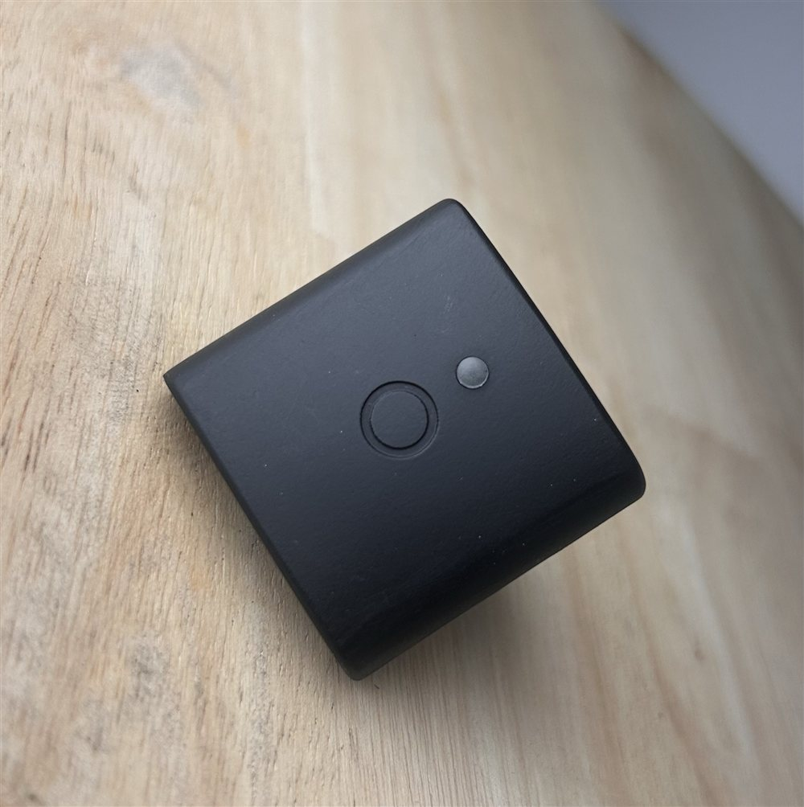

# About Sensors

The basics of handling a sensor: charging it, waking it, resetting it, and
reading the light on it.

<figure>
  
  <figcaption>A Level Inez sensor. It has a status LED, a button, a USB-C port for charging, and a small reset button - take a moment to find each of these on your own sensor.</figcaption>
</figure>

## Charging

Each sensor charges from any USB-C cable and charger. Check a sensor's battery level in the app.

## Waking and sleeping

A sensor is either awake or asleep. It sleeps to save battery and wakes
automatically when you pick it up or move it. An asleep sensor shows no light
and will not appear in the app until it wakes.

## Reset button

There is a small reset button next to the USB-C port. If a sensor does not wake
on movement, or stops responding, press the reset button and it will restart.

## LED light patterns

The sensor has a single multi-colour LED that shows what the device is doing.
The colour tells you the broad state; the pattern (solid, breathing, or
blinking) tells you the mode within that state.

| What the sensor is doing        | Colour            | Pattern                                  |
|---------------------------------|-------------------|------------------------------------------|
| Idle, waiting for connection    | User Define       | Breathing (smooth fade up and down)      |
| Connected, not recording        | User Define       | Solid                                    |
| Recording (streaming data)      | User Define       | Blinking (short on, longer off)          |
| Error                           | Red               | Solid                                    |
| Deep sleep                      | No light          | -                                        |

**Breathing** means the light fades smoothly up and down. You see this while the
sensor is powered on and waiting to connect (or after it disconnects and returns
to waiting).

**Blinking (recording)** is a distinct on/off rhythm. This is the pattern to
look for to confirm a sensor is actively recording.

**Solid** means steady, constant light with no change. Used for the connected
and error states.

### Notes

- **Colours can be customised.** The sensor colour (used for the idle,
  connected, and recording states) can be changed per sensor from the app, so a
  deployment may use different colours.
- **No light at all** means the sensor is asleep or the battery is fully
  depleted.
