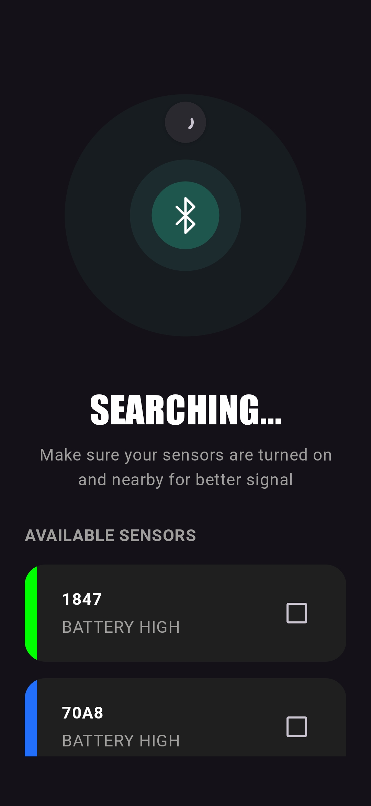
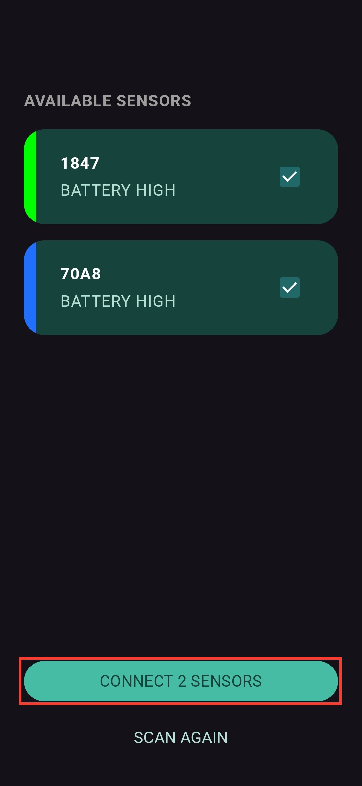
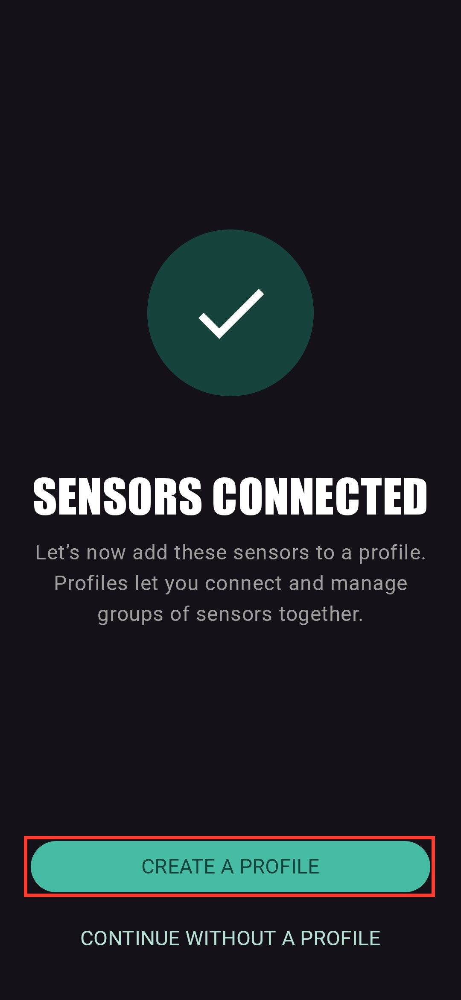
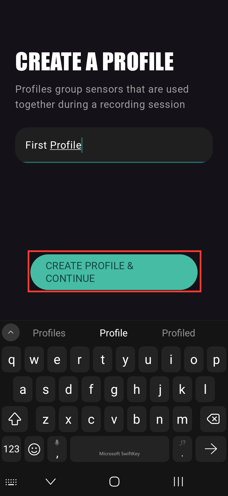
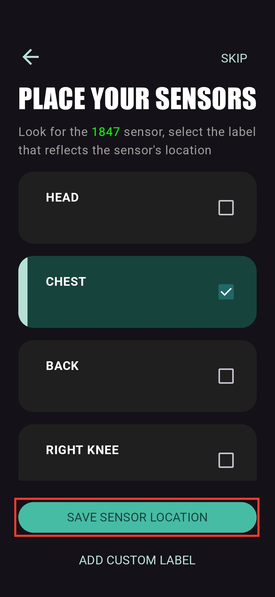
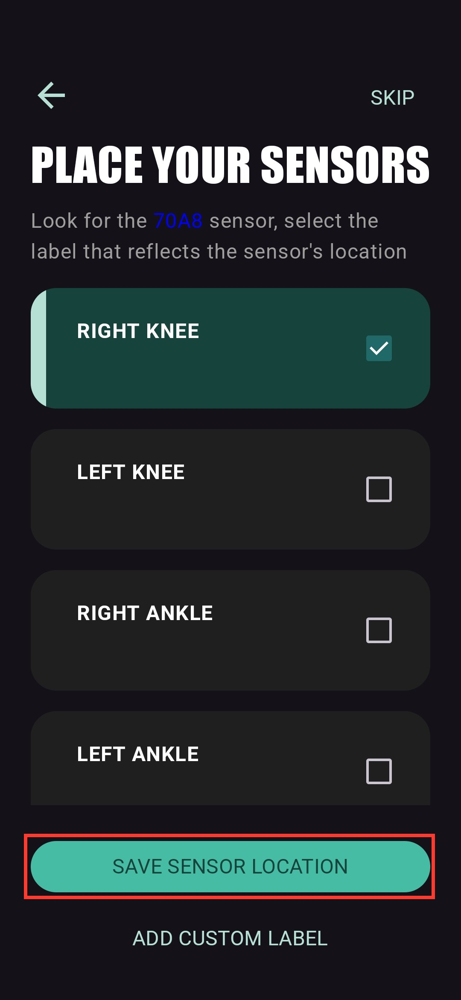
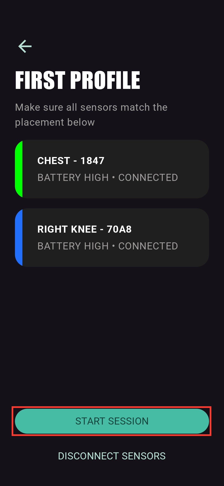
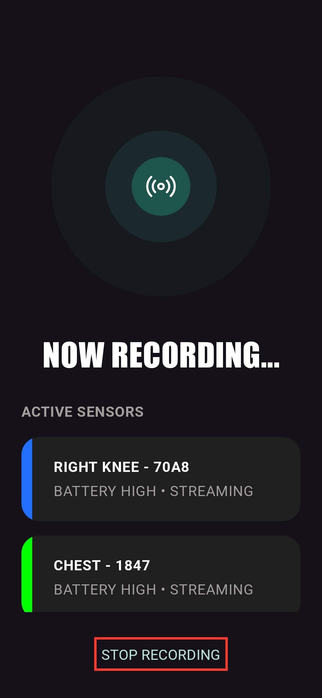

# Collecting Data

This guide walks a full recording session in the LEVEL Sensor app, from
connecting sensors to saving the data. To send the recorded files off the
phone afterwards, see [Sharing recorded data](sharing-data).

## 1. Prepare the sensors

Make sure the sensors are charged. Each sensor charges from any USB-C cable and
charger - there is nothing special to plug in.

A sensor is either awake or asleep. It sleeps to save battery and wakes
automatically when you pick it up or move it. If a sensor does not wake on
movement, press the small reset button next to its USB-C port.

Once a sensor is awake you can connect to it. For what the light on the sensor
means and other sensor basics, see [About sensors](about-sensors).

## 2. Connect your sensors

Open the LEVEL Sensor app. It scans for nearby sensors automatically. Make sure
your sensors are turned on and nearby - each one appears in the list with its
ID and battery level.

Tick the sensors you want to use, then tap **CONNECT N SENSORS**.

## 3. Create a profile (first time only)

Once the sensors connect, the app asks you to add them to a profile. A profile
groups the sensors you use together, so next session you can reconnect the
whole set in one tap. Tap **CREATE A PROFILE**, give it a name, and tap
**CREATE PROFILE & CONTINUE**.

## 4. Label each sensor's placement

For each sensor, the app highlights the sensor ID and asks where on the body it
is placed. Pick the label that matches (or **ADD CUSTOM LABEL**), then tap
**SAVE SENSOR LOCATION**. The label ends up in the CSV filename, so accurate
labels make the data much easier to work with later.

## 5. Record the session

The profile screen shows every sensor with its placement, ID, battery, and
connection status. When everything reads CONNECTED, tap **START SESSION**.

While recording, each sensor shows STREAMING. Run your movement or test, then
tap **STOP RECORDING**.

## 6. Done - your data is saved

The Recording Saved screen confirms where the files went: one CSV per sensor,
in a folder named after the date and time of the session under
`Documents/LEVEL_Sensor/`. Each recording session creates its own folder.

From here you can share the data straight away - see
[Sharing recorded data](sharing-data).
