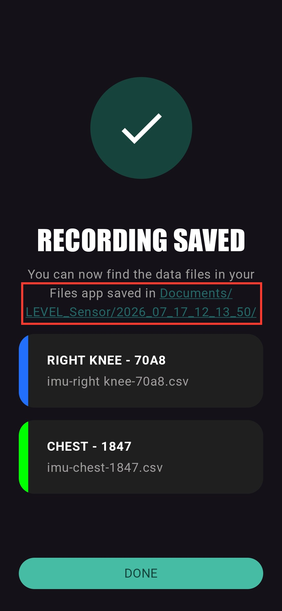
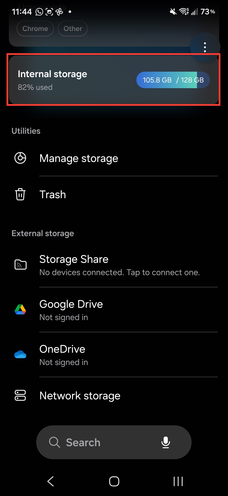
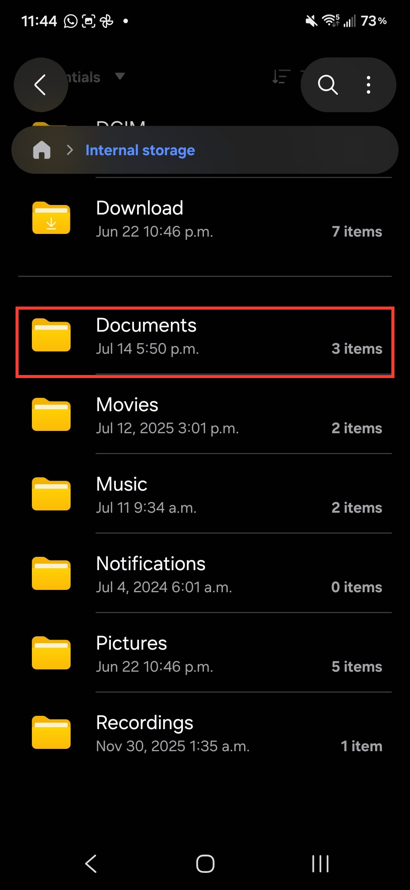
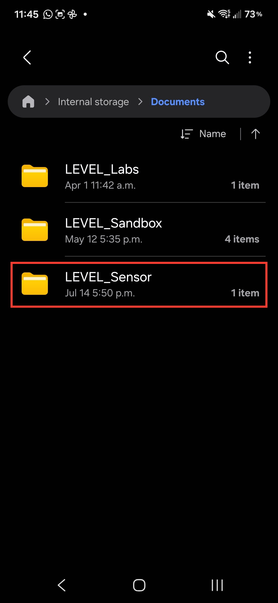
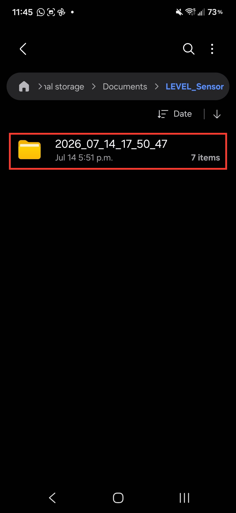
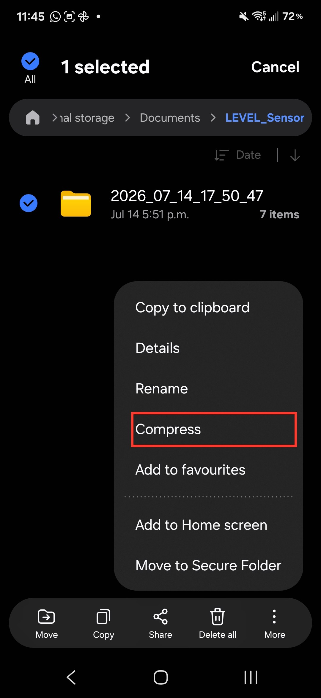
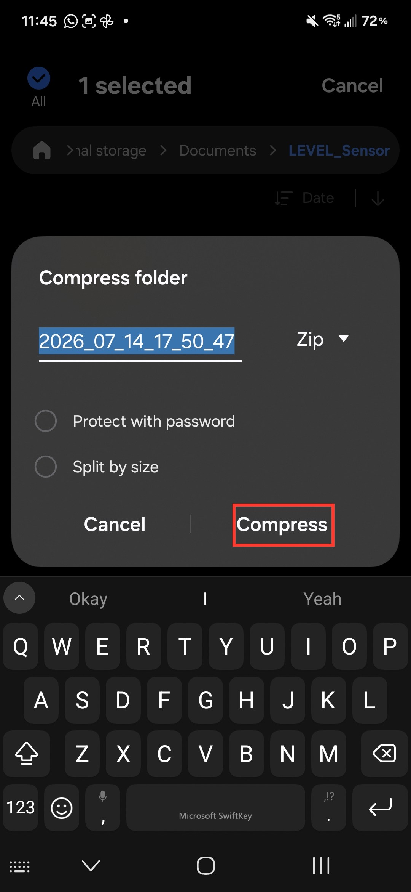

# Sharing Recorded Data

Every recording session saves one CSV file per sensor to the phone's internal
storage, in a folder named after the date and time of the session:

```
Internal storage / Documents / LEVEL_Sensor / 2026_07_17_12_13_50 /
    imu-chest-1847.csv
    imu-right knee-70a8.csv
```

(For the recording workflow itself - connecting sensors, profiles, placement
labels - see [Collecting data](collecting-data).)

There are two ways to get that data off the phone:

- **[Option A](#option-a-share-right-after-recording)** - share directly from
  the LEVEL Sensor app, right after you finish a recording. Fastest when you
  are still holding the phone at the end of a session.
- **[Option B](#option-b-share-later-with-my-files)** - use the My Files app
  (pre-installed on Samsung phones) to find, zip, and send a session folder
  after the fact. Use this for older sessions or when sending several sessions
  at once.

---

## Option A: Share right after recording

When you stop a recording, the Recording Saved screen lists the CSV file saved
for each sensor and shows the folder they were saved to. Tap the
**Documents/LEVEL_Sensor/...** link and the app zips the whole session folder
and opens the share screen for you - pick how to send it (email, Drive, or any
other app on the phone) and it goes out as a single zip attachment.



To send just one sensor's data instead, tap that sensor's card in the list -
the share screen opens with only that CSV file attached.

<!-- TODO: add a screenshot of the share sheet after tapping the link. -->

---

## Option B: Share later with My Files

Any past session can be found and sent with the My Files app that comes
pre-installed on Samsung phones. (On other Android phones the equivalent app
is usually called Files or Files by Google - the steps are the same, but the
screens look different.)

### 1. Open My Files and go to Internal storage

Open **My Files** (swipe up on the home screen and search for it if you don't
see the icon). On the home screen of My Files, scroll to and tap
**Internal storage**.



### 2. Navigate to Documents, then LEVEL_Sensor

Inside Internal storage, open the **Documents** folder, then open
**LEVEL_Sensor**. Each recording session is a folder named by its date and
time, for example `2026_07_14_17_50_47` for a session recorded on
July 14 at 5:50 p.m.





### 3. Compress the session folder to a zip

Long-press the session folder to select it, tap **More** (the three dots at
the bottom right), and choose **Compress**. Keep the suggested name and the
**Zip** format, then tap **Compress**. The zip file appears next to the folder.

Zipping keeps the files of a session together in one attachment and makes them
smaller to send. Leave **Protect with password** off unless you have been asked
to password-protect the data.




### 4. Share the zip

Long-press the new zip file to select it, then tap **Share** in the bottom bar
and pick how to send it - email, Drive, or any other app on the phone.

<!-- TODO: add screenshots of selecting the zip and the share sheet. -->

---

## Tips

- **One folder per session.** If you ran several trials, each STOP RECORDING
  created its own timestamped folder. Check the date and time in the folder
  name to pick the right one.
- **Filenames carry the placement.** Files are named
  `imu-<placement>-<sensor id>.csv` (for example `imu-chest-1847.csv`), so
  labelling placements correctly during setup (see
  [Collecting data](collecting-data)) is what makes the data identifiable
  afterwards.
- **Sending many sessions:** in My Files you can select several session
  folders at once before tapping Compress, which produces a single zip.
